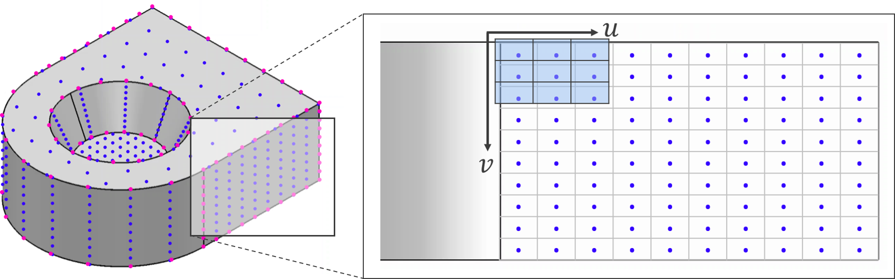

# UV-Net: Learning from Boundary Representations

This repository contains code for the paper:

["UV-Net: Learning from Boundary Representations."](https://arxiv.org/abs/2006.10211) Pradeep Kumar Jayaraman, Aditya Sanghi, Joseph G. Lambourne, Karl D.D. Willis, Thomas Davies, Hooman Shayani, Nigel Morris. CVPR 2021.


UV-Net is a neural network designed to operate directly on Boundary representation (B-rep) data from 3D CAD models. The B-rep format is widely used in the design, simulation and manufacturing industries to enable sophisticated and precise CAD modeling operations. However, B-rep data presents some unique challenges when used with neural networks due to the complexity of the data structure and its support for various disparate geometric and topological entities.

In UV-Net, we represent the geometry stored in the edges (curves) and faces (surfaces) of the B-rep using 1D and 2D UV-grids, a structured set of points sampled by taking uniform steps in the parameter domain. 1D and 2D convolutional neural networks can be applied on these UV-grids to encode the edge and face geometry.



The topology is represented using a face-adjacency graph where features from the face UV-grids are stored as node features, and features from the edge UV-grids are stored as edge features. A graph neural network is then used to message pass these features to obtain embeddings for faces, edges and the entire solid model.


## Environment setup

```
conda env create -f environment.yml
conda activate uv_net
```

For CPU-only environments, the CPU-version of the dgl has to be installed manually:
```
conda install -c dglteam dgl=0.6.1=py39_0
```

## Training

The classification model can be trained using:
```
python classification.py train --dataset solidletters --dataset_path /path/to/solidletters --max_epochs 100 --batch_size 64 --experiment_name classification
```

Only the SolidLetters dataset is currently supported for classification.

The segmentation model can be trained similarly:
```
python segmentation.py train --dataset mfcad --dataset_path /path/to/mfcad --max_epochs 100 --batch_size 64 --experiment_name segmentation
```

The MFCAD and Fusion 360 Gallery segmentation datasets are supported for segmentation.

The logs and checkpoints will be stored in a folder called `results/classification` or `results/segmentation` based on the experiment name and timestamp, and can be monitored with Tensorboard:

```
tensorboard --logdir results/<experiment_name>
```

## Testing
The best checkpoints based on the smallest validation loss are saved in the results folder. The checkpoints can be used to test the model as follows:

```
python segmentation.py test --dataset mfcad --dataset_path /path/to/mfcad/ --checkpoint ./results/segmentation/best.ckpt
```

## Data
The network consumes [DGL](https://dgl.ai/)-based face-adjacency graphs, where each B-rep face is mapped to a node, and each B-rep edge is mapped to a edge. The face UV-grids are expected as node features and edge UV-grids as edge features. For example, the UV-grid features from our face-adjacency graph representation can be accessed as follows:

```python
from dgl.data.utils import load_graphs

graph = load_graphs(filename)[0]
graph.ndata["x"]  # num_facesx10x10x7 face UV-grids (we use 10 samples along the u- and v-directions of the surface)
                  # The first three channels are the point coordinates, next three channels are the surface normals, and
                  # the last channel is a trimming mask set to 1 if the point is in the visible part of the face and 0 otherwise
graph.edata["x"]  # num_edgesx10x6 edge UV-grids (we use 10 samples along the u-direction of the curve)
                  # The first three channels are the point coordinates, next three channels are the curve tangents
```

### SolidLetters

SolidLetters is a synthetic dataset of ~96k solids created by extruding and filleting fonts. It has class labels (alphabets), and style labels (font name and upper/lower case) for each solid.

The dataset can be downloaded from here: https://uv-net-data.s3.us-west-2.amazonaws.com/SolidLetters.zip

To train the UV-Net classification model on the data: 

1. Extract it to a folder, say `/path/to/solidletters/`. Please refer to the license in `/path/to/solidletters/SolidLetters Dataset License.pdf`.

2. There should be three files:

- `/path/to/solidletters/smt.7z` contains the solid models in `.smt` format that can be read by a proprietory Autodesk solid modeling kernel and the Fusion 360 software.
- `/path/to/solidletters/step.zip` contains the solid models in `.step` format that can be read with OpenCascade and its Python bindings [pythonOCC](https://github.com/tpaviot/pythonocc-core).
- `/path/to/solidletters/graph.7z` contains the derived face-adjacency graphs in DGL's `.bin` format with UV-grids stored as node and edge features. This is the data in that gets passed to UV-Net for training and testing. Extract this file.

3. Pass the `/path/to/solidletters/` folder to the `--dataset_path` argument in the classification script and set `--dataset` to `solidletters`.

### MFCAD

The original solid model data is available here in STEP format: [github.com/hducg/MFCAD](https://github.com/hducg/MFCAD).

We provide pre-processed DGL graphs in `.bin` format to train UV-Net on this dataset.

1. Download and extract the data to a folder, say `/path/to/mfcad/` from here: https://uv-net-data.s3.us-west-2.amazonaws.com/MFCADDataset.zip

2. Pass the `/path/to/mfcad/` folder to the `--dataset_path` argument in the segmentation script and set `--dataset` to `mfcad`.

### Fusion 360 Gallery segmentation

We provide pre-processed DGL graphs in `.bin` format to train UV-Net on the [Fusion 360 Gallery](https://github.com/AutodeskAILab/Fusion360GalleryDataset) segmentation task.

1. Download and extract the dataset to a folder, say `/path/to/fusiongallery/` from here: https://uv-net-data.s3.us-west-2.amazonaws.com/Fusion360GallerySegmentationDataset.zip

2. Pass the `/path/to/fusiongallery/` folder to the `--dataset_path` argument in the segmentation script and set `--dataset` to `fusiongallery`.


## Processing your own data
Refer to our [guide](process/README.md) to process your own solid model data (in STEP format) into the `.bin` format that is understood by UV-Net, convert STEP files to meshes and pointclouds.

## Citation

```
@inproceedings{jayaraman2021uvnet,
 title = {UV-Net: Learning from Boundary Representations},
 author = {Pradeep Kumar Jayaraman and Aditya Sanghi and Joseph G. Lambourne and Karl D.D. Willis and Thomas Davies and Hooman Shayani and Nigel Morris},
 eprint = {2006.10211},
 eprinttype = {arXiv},
 eprintclass = {cs.CV},
 booktitle = {IEEE Conference on Computer Vision and Pattern Recognition (CVPR)},
 year = {2021}
}
```
